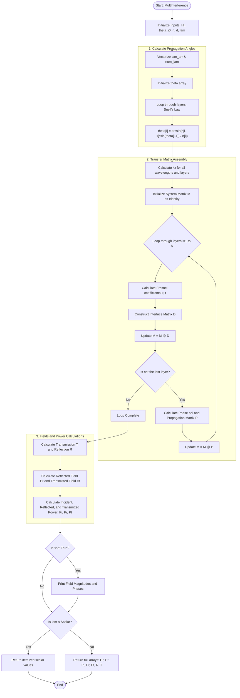
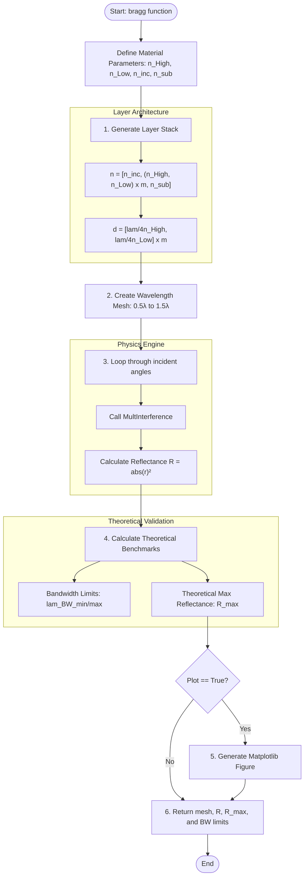
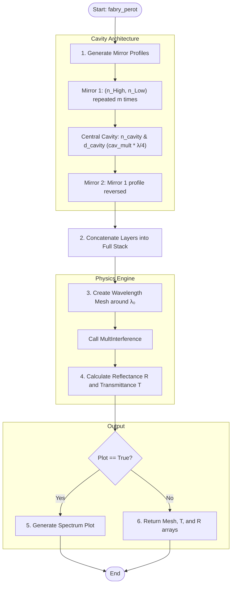

*Multinterference.py*

```mermaid
graph TD
    A([Start: MultInterference]) --> B[Initialize Inputs: Hi, theta_i0, n, d, lam]
    B --> C[Vectorize lam_arr & num_lam]
    
    subgraph AngleCalculation [1. Calculate Propagation Angles]
        C --> D[Initialize theta array]
        D --> E[Loop through layers: Snell's Law]
        E --> F["theta[i] = arcsin(n[i-1]*sin(theta[i-1]) / n[i])"]
    end

    F --> G[Calculate kz for all wavelengths and layers]

    subgraph MatrixMethod [2. Transfer Matrix Assembly]
        G --> H[Initialize System Matrix M as Identity]
        H --> I{Loop through layers i=1 to N}
        I --> J[Calculate Fresnel coefficients: r, t]
        J --> K[Construct Interface Matrix D]
        K --> L[Update M = M @ D]
        L --> M{Is not the last layer?}
        M -- Yes --> N[Calculate Phase phi and Propagation Matrix P]
        N --> O[Update M = M @ P]
        O --> I
        M -- No --> P[Loop Complete]
    end

    P --> Q[Calculate Transmission T and Reflection R]
    
    subgraph FinalOutput [3. Fields and Power Calculations]
        Q --> R[Calculate Reflected Field Hr and Transmitted Field Ht]
        R --> S[Calculate Incident, Reflected, and Transmitted Power: Pi, Pr, Pt]
    end

    S --> T{Is 'ind' True?}
    T -- Yes --> U[Print Field Magnitudes and Phases]
    T -- No --> V{Is lam a Scalar?}
    U --> V

    V -- Yes --> W[Return itemized scalar values]
    V -- No --> X[Return full arrays: Hr, Ht, Pi, Pr, Pt, R, T]
    
    W --> Y([End])
    X --> Y

```

*Bragg.py*

```mermaid
graph TD
    Start([Start: bragg function]) --> Setup[Define Material Parameters: n_High, n_Low, n_inc, n_sub]
    Setup --> LayerGen[1. Generate Layer Stack]
    
    subgraph LayerConstruction [Layer Architecture]
        LayerGen --> N_Array["n = [n_inc, (n_High, n_Low) x m, n_sub]"]
        N_Array --> D_Array["d = [lam/4n_High, lam/4n_Low] x m"]
    end

    D_Array --> MeshGen[2. Create Wavelength Mesh: 0.5λ to 1.5λ]
    MeshGen --> Loop[3. Loop through incident angles]
    
    subgraph Simulation [Physics Engine]
        Loop --> CallMult[Call MultInterference]
        CallMult --> GetR["Calculate Reflectance R = abs(r)²"]
    end

    GetR --> Theory[4. Calculate Theoretical Benchmarks]
    
    subgraph Analytics [Theoretical Validation]
        Theory --> BW[Bandwidth Limits: lam_BW_min/max]
        Theory --> RMax[Theoretical Max Reflectance: R_max]
    end

    RMax --> PlotCheck{Plot == True?}
    PlotCheck -- Yes --> Plotting[5. Generate Matplotlib Figure]
    PlotCheck -- No --> Returns[6. Return mesh, R, R_max, and BW limits]
    
    Plotting --> Returns
    Returns --> End([End])

```

*Fabry_perot.py*

```mermaid

graph TD
    Start([Start: fabry_perot]) --> MirrorGen[1. Generate Mirror Profiles]
    
    subgraph Construction [Cavity Architecture]
        MirrorGen --> M1["Mirror 1: (n_High, n_Low) repeated m times"]
        M1 --> Cavity["Central Cavity: n_cavity & d_cavity (cav_mult * λ/4)"]
        Cavity --> M2["Mirror 2: Mirror 1 profile reversed"]
    end

    M2 --> Concat[2. Concatenate Layers into Full Stack]
    Concat --> Mesh[3. Create Wavelength Mesh around λ₀]
    
    subgraph Analysis [Physics Engine]
        Mesh --> Multi[Call MultInterference]
        Multi --> PowerCalc[4. Calculate Reflectance R and Transmittance T]
    end

    PowerCalc --> PlotCheck{Plot == True?}
    
    subgraph Visualization [Output]
        PlotCheck -- Yes --> PlotGen[5. Generate Spectrum Plot]
        PlotCheck -- No --> ReturnData[6. Return Mesh, T, and R arrays]
    end

    PlotGen --> End([End])
    ReturnData --> End

```
