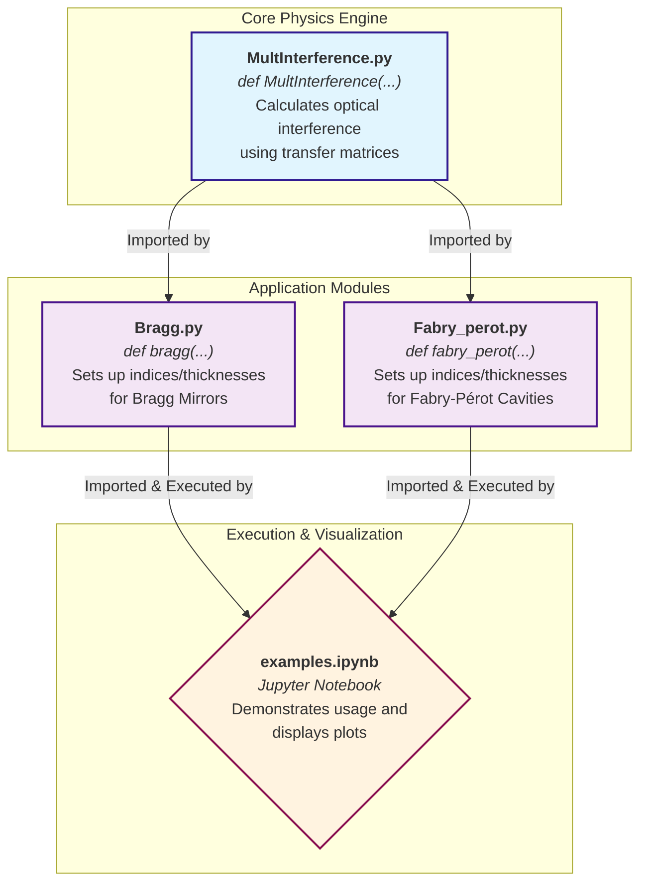

# MultInterface

Program and accompanying poster to calculate optical interference on multilayer materials, along with some interesting use cases.

Copyright Lucas Berredo, Marcos Vázquez, 2026, licenced under the EUPL.

### Code explanation (flow diagram)

** For individual file explanations, check subdirectories **

